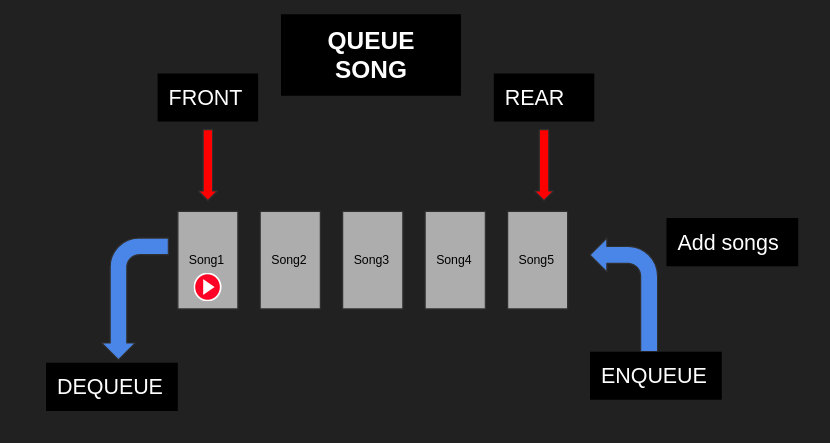
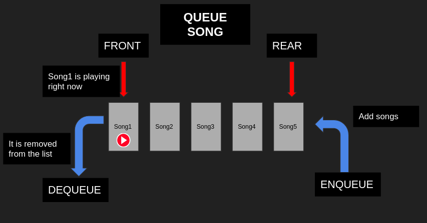

# Queue
## Introduction
The term Queue is use to modified a group of items stored in a list. You can basically can control the flow of your task using queues. In the real world queue is used to know the sequence of of people waiting their turn to be attended.

The most used type of queues are the following:
- FIFO
- LIFO
  
# FIFO rule
FIFO stands for first in, first out. Basically *FIFO gets the first item that first was put in*.

A common problem of using FIFO we can find is in the music streaming apps. When we add a song to our list and then we play the list, the app will play from the first songs to the last one in th list.                              

```python
import queue

q = queue.Queue()

q.put('First-process')
q.put('Second-process')
q.put('Third-process')

for i in range(3):
    print(q.get())
```

As result of this example we have the following:

```bash
First-song
Second-song
Third-song
```

# LIFO rule
LIFO stands last in, first out. In this method *the last item in the list is the first item to be precessed*, and the first element would be processes at the end.       

A common problem we find in the real world is when we are using our computer. When the user wants to redo a process they are basically using the LIFO method. When we type Ctr+Z (in Windows) to redo, so the computer would give us *the last process we were doing*. The next example shows how this process is performed:

```python
import queue  

lifo = queue.LifoQueue()

lifo.put('First-process')
lifo.put('Second-process')
lifo.put('Third-process')

for i in range(3):
    print(lifo.get())
```
As the result of this example we have the following:
```bash
First-process
Second-process
Third-process
```
# Enqueue
Enqueue is one of the operations we can use in Queue. Is nothing but *inserting data into the queue*, specifically into the back of the queue.

If we take the example of the music streaming app. Every time we add a song to the list, it is basically doing an Enqueue process as the following image shows:




To Enqueue an element we use: *append method*

# Dequeue
Dequeue is another operation that we can use in queues. Dequeue *deletes data or items from the Queue*, specifically deleting from the front of the Queue.

Taking the example. We can see that the first item is playing right now and then when this process is finished the song is dequeue. It is to say, this first element is removed from the list. 



To Dequeue an element we use: *pop method*

It is important to know that we should specify that we are going to pop the fisrt element as the following:

```python
queue=[]
queue.append(10)
queue.append(20)
queue.append(30)

queue.pop(0)
queue
```
As we see in this example we insert elemts using append and we deleted the first method by usong pop(0)/ The result will be the following.

```bash
[20,30]
```

# Example: Vaccination List

In the example below, we will write a simple common example we can see nowadays with the process of registering for a vaccination. First of all, we register on a web page so our names are save in a list. When the vaccine is available they would call from the first one on the list and every time they are already vaccinated thee names are removed from the list. This process helps the people to follow an order so, the first one who registered on the list would be called first. This is the process of this task:

- Register
- Name is appended in a list 
- When the vaccine is available they start to vaccinate people
- First one who registered is the first one to vaccinate and so on.
- The name is removed from the list.
- Do the same with the next people in the list, in this case, the second name in the list.

```python
class vaccination_Queue:

    def __init__(self):
        self.queue = []

    def enqueue(self,name):
        self.queue.append(name)

    def dequeue(self):
        if len(self.queue) <= 0:
            raise IndexError()

        name = self.queue[0]
        del self.queue[0]
        return name

    def get_queue(self):
        return self.queue
```
To prove our code is working. We going to pretend that there are four people registered in this list in the next order: Christian, David, Daniel, Oscar.

Then the code for this part would be the following:

```python
print('Test 1')
queue = vaccination_Queue()
queue.enqueue('Christian')
queue.enqueue('David')
queue.enqueue('Daniel')
queue.enqueue('Oscar')
print(queue.get_queue())
```
The result in the terminal would be this:

```bash
Test 1
['Christian', 'David', 'Daniel', 'Oscar']
```
Now we are going to say that the vaccine is already for the people. According with the order in the list, Christian should be the first one to be vaccinated because He came first.

```python
name = queue.dequeue()
print(queue.get_queue())
```
For this process, we use the Dequeue function, which is going to take the first item in the list, and then it will be deleted from the list. 

Finally, the list should look like this:

```bash
Test 1
['David', 'Daniel', 'Oscar']
```
Here, you can download this code and practice. [Example](queue-example.py)


# Problem to Solve: Add song to a playlist

This problem to solve is a common program we find in many playlist apps. The purpose of this problem is to practice and apply the concepts already seen in this document.

You can download the template here: [Template](problem-template.py)

This program implements Enqueue and Dequeue functions. Here are de detailed requirements:

- Prompt the user for a song. album and genre
- Add this three characteristic to a Queue (Enqueue)
- The Dequeue function should remove songs from the font of the list
- The program should display the song that is now playing.

Download the following code and load it into your code editor. This document will also provide more details.

You can test your program with the following scenarios:
- Test 1: Add two songs and display the current song playing. It should display the first song in the list as a "now playing" song
- Test 2: No add any song so, it should display a "No songs in the list" message
- Test 3: Add two songs and remove one. It should display the second song in the list as now playing song.
- Test 4: Add two songs and remove two. It should display "No songs in the list"


You can check your code with the solution here: [Solution](problem-solution.py)

[Back to Welcome Page](data_structure_tutorial.md)
